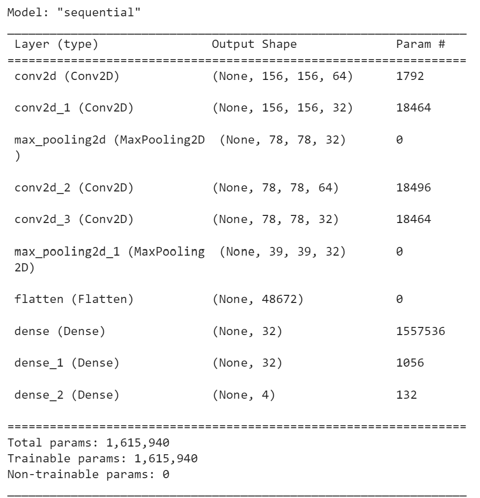

# Multi-Class Classification on the COVID-19 Chest X-Ray Dataset

---

### **1. Problem Definition**
The project leverages computer vision and deep learning techniques to classify chest X-rays into four categories:  
- **Viral Pneumonia**  
- **COVID-19**  
- **Bacterial Pneumonia**  
- **Healthy**  

Medical applications of computer vision include:
- More accurate diagnoses and early identification of high-risk cases.
- Reduced manual workload for healthcare providers.
- Automation of medical image analysis to save time and resources.

---

### **2. Dataset and Preprocessing**
- **Dataset Overview**:
  - **Total Images**: 6,392
  - **Classes**:
    - Bacterial Pneumonia: 2,816 images
    - COVID-19: 127 images
    - Healthy: 1,606 images
    - Viral Pneumonia: 1,843 images
  - **Image Dimensions**: 156 x 156

- **Preprocessing Steps**:
  - One-hot encoding for categorical representation.
  - Stratified data split: **64% training, 16% validation, 20% testing**.
  - Normalization to reduce noise and improve model performance.

---

### **3. Baseline Model**
- **Architecture**:
  

- **Training**:
  - Loss: Categorical Cross-Entropy
  - Optimizer: Adam
  - Checkpoints to save best-performing weights.

- **Performance**:
  - **Validation Accuracy**: 78.1%
  - **Test Accuracy**: 76.4%

- **Validation Confusion Matrix**:
  

- **Test Confusion Matrix**:
  

- **Training History**:
  

- **ROC Curves**:
  - **Validation ROC Curve**:
    
  - **Test ROC Curve**:
    

---

### **4. Fine-Tuned Model**
- **Architecture**:
  

- **Improvements**:
  - Data augmentation: Rotation, zoom, and vertical flipping.
  - Increased convolutional layers (6) and filters (32 to 256).
  - Added dropout layers (0.2 rate) and L2 regularization.
  - Early stopping based on validation accuracy.

- **Performance**:
  - **Validation Accuracy**: 81.5%
  - **Test Accuracy**: 81.9%

- **Validation Confusion Matrix**:
  

- **Test Confusion Matrix**:
  

- **Training History**:
  

- **ROC Curves**:
  - **Validation ROC Curve**:
    
  - **Test ROC Curve**:
    

---

### **5. Transfer Learning**
- **Models Used**:
  - ResNet50 and VGG16 (VGG16 outperformed ResNet50).

- **Approach**:
  - Fine-tuned pre-trained weights.
  - Added 2 dense layers (64 neurons), dropout, and regularization.

- **Performance**:
  - **Validation and Test Accuracy**: Similar to the fine-tuned model.

---

### **6. Discussion**
- The models successfully leveraged deep learning for multi-class classification, achieving reasonable accuracy despite challenges like overfitting and limited COVID-19 data.
- Fine-tuning and transfer learning showed promising results, but further optimizations (e.g., hyperparameter tuning) could improve performance.
- The project was constrained by limited computational resources, which hindered exhaustive experimentation.

---

### **7. Key Learnings**
This project highlighted:
- The potential of deep learning in medical imaging.
- The importance of robust preprocessing techniques.
- The challenges of class imbalance and overfitting.
- The need for more computational power for advanced model tuning.

---

### **8. References**
1. Ahmed F., Bukhari S.A.C., Keshtkar F. (2021). *A deep learning approach for COVID-19 viral pneumonia screening with X-Ray images*. DOI: 10.1145/3431804.
2. Meedeniya D. et al. (2022). *Chest X-ray analysis empowered with deep learning: A systematic review*. DOI: 10.1016/j.asoc.2022.109319.
